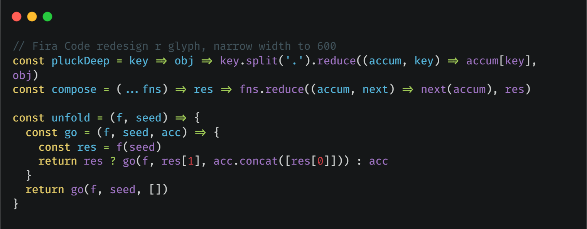
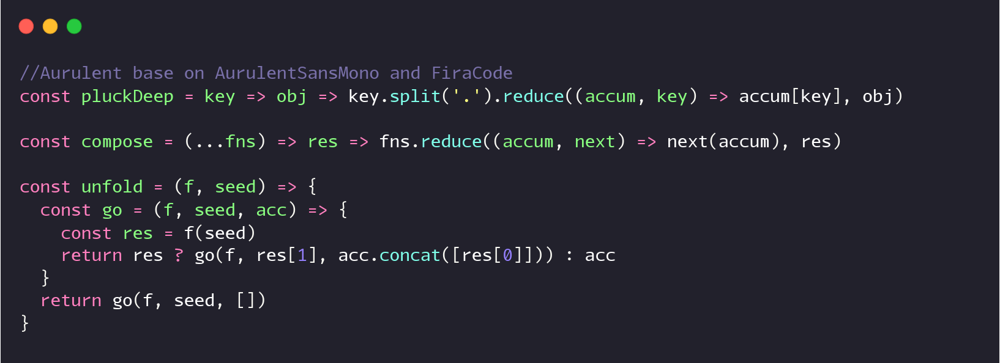
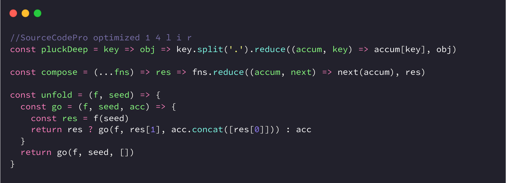

> Buy a 4K+ resolution monitor to overcome your programming font addiction, and get the fucking job done!

### Screenshots
Fira Code

Aurulent

Source Code Pro


### Best fonts for programming
1. Aurulent: It looks like it was written by an calligraphy pen, add the missing glyphs from Fira Code, my favorite.
2. Source Code Pro: Simple and crisp, optimized the 0 1 4 r i l glyphs, make it applies to both prose and coding.
3. FangSongCode: Source Code Pro with 聚珍新仿，see more on [DIY 中文编程字体](https://zhi.moe/post/programming-font-for-chinese/)。
4. Fira Code: [Most popular coding font](https://github.com/tonsky/FiraCode), patched with nerd fonts and redesigned the r glyph.
5. 字语青梅硬笔：手写中文字体，适用于 excalidraw 手画风格的架构图。
6. Monaspace Argon: programming font from [GitHub Next](https://monaspace.githubnext.com/#learn-more), the goat! 

### Tips:
1. you can rename the family name by [fontname.py](https://github.com/chrissimpkins/fontname.py):
```bash
python  fontname.py  "SF Mono"  FiraCode-Regular.ttf 
```

2. for non-4K monitor, you need hint the truetype font:
```bash
sudo apt install ttfautohint
for f in ./*.ttf; do ttfautohint ${f} out/${f} --stem-width-mode qqq --composites ;done
```

3. patch powerline for your font:
```bash
docker run --rm -v ./:/in:Z -v ./patched:/out:Z nerdfonts/patcher --use-single-width-glyphs --boxdrawing --powerline --powerlineextra
```

4. 中英文合并的字体中文间距很大的问题解决方案
```python
from fontTools.ttLib import TTFont
font = TTFont('C:\\Documents\\YaHei.ttf')

# xAvgCharWidth 只能脚本设置，fontforge 计算的不对
# 设置成中文字符宽度的 1/2，否则部分 windows 软件（字体预览、notepad）中文间距很大
font['OS/2'].xAvgCharWidth = 500
# 下面两个在 fontforge 也可以设置，设置后 terminal 可以识别成等宽字体
font['OS/2'].panose.bProportion = 9  # 9 表示 monospaced,0 表示 any
font['OS/2'].panose.bFamilyType = 2  # 2 表示 Latin: Text and Display 
font.save('C:\\Documents\\YaHei-R.ttf')
# 注意，大部分 terminal 展示非 ascii 字符的宽度是 ascii 字符*2，
# 由于 FangSongCode 的 ASCII 字符是 600，所以会用 1200 宽度展示中文字符，导致看着间距很大并且不是居中
# 目前无解，只能选用中英 2:1 的字体中文才能正常展示，Yahei:Consolas=1000:550，间距看着会正常一点
```

