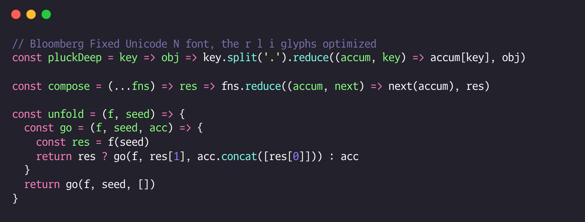

> Buy a 4K+ resolution monitor to overcome your programming font addiction, and get the fucking job done!

### Screenshots
Fira Code

Aurulent

Source Code Pro

Bloomberg


### Best fonts for programming
1. Aurulent: It looks like it was written by an artisan pen, add missing glyphs from fira code, my favorite.
2. Source Code Pro: Simple and crisp, optimized the 0 1 4 r i l glyphs, make it applies to both prose and coding, my system font.
3. Fira Code: [Most popular coding font](https://github.com/tonsky/FiraCode), add some powerline glyphs and redesigned the r glyph.
4. 方正聚珍新仿: 搭配上面的Source Code Pro的中文字体，适用于注释, 也适合电子书阅读.
5. 字语青梅硬笔: 手写中文字体，适用于excalidraw手画风格的架构图.
6. FangSongCode: Source Code Pro with chinese glyphs from 聚珍新仿， see more on [支持中文的等宽编程字体-FangSongCode](https://zhi.moe/post/programming-font-fangsongcode/)
7. Monaspace Argon: programming font from [GitHub Next Labs](https://monaspace.githubnext.com/#learn-more), the best! 
8. Bloomberg: neutral font for long text reading.

### Tips:
1. you can rename the family name by [fontname.py](https://github.com/chrissimpkins/fontname.py):
```bash
python  fontname.py  "Monaspace"  MonaspaceArgon-Regular.ttf 
```

2. for non-4K monitor, you need hint the truetype font:
```bash
sudo apt install ttfautohint
for f in ./*.ttf; do ttfautohint ${f} out/${f} --stem-width-mode qqq --composites ;done
```

3. patch powerline for your font:
```bash
docker run --rm -v ./:/in:Z -v ./patched:/out:Z nerdfonts/patcher --use-single-width-glyphs --boxdrawing --powerline --powerlineextra
```


